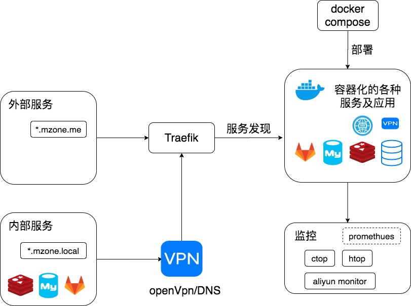

# 当我有一台服务器时我做了什么

当一八年末的时候，我写了一篇文章 [当我有一台服务器时我做了什么](https://github.com/shfshanyue/op-note/blob/master/when-server.md)

又是年末，我服务器的架构也发生了一些变化，因此总结一番

<!--more-->

+ 原文地址: [当我有一台服务器时我做了什么](https://github.com/shfshanyue/op-note/blob/master/when-server-2019.md)
+ 系列文章: [当我有一台服务器时我做了什么](https://github.com/shfshanyue/op-note)

## 概览

开发服务器：一台 1C2G，后期可以考虑 一台 2C4G

服务器列表：

+ `dev`: 1C2G，不到一百块钱。用以日常编码，简单的反向代理以及项目部署



## 博客与编码

基本上自己的博客以及个人编码都在这台测试服务器上完成，至于为什么要在服务器下开发：

1. 在公司 Mac 及我自己的笔记本间同步博客实在太痛苦了，而使用服务器作为中介则方便很多

由于在服务器下写博客以及一些个人的代码，因此我新买的 MBP 也变成了一个显示器

### 开发环境

`zsh` + `tmux` + `vim`，截图如下


大部分时间都在这个模式下，如果写博客过程中需要截图，则先下载到随便一个目录，然后使用 `rsync` 复制到目标路径

``` bash
$ rsync ~/Documents/tmux.png dev:/path/Documents/blog/op/assets/dev-env.png
```

`vscode remote`

如果需要调试代码，或者在写 `typescript`，则使用 `vscode remote` 来完成工作

在 vscode 插件中关键字搜索，安装下载最多的三个插件就是了

### 开发调试

如果调试前端页面需要在浏览器中打开地址，比如 `IP:8000`，一般采用两种方案

1. `nginx`镜像 + `volume`挂载 + `docker-compose` + `traefik`服务发现。略微麻烦
1. `npm run dev` + `openvpn`。在本地环境中的浏览器通过 `openvpn` 连接局域网

如果调试后端接口，需要打断点直接使用 `vscode remote`

## 对外服务

有几个在公网下可访问的服务，如

+ [公众号开发](https://github.com/shfshanyue/wechat): 主要用以给我的公众号导流 -> 如果想知道流程是什么，请转到这篇文章 [两年前端头条面试记](https://q.shanyue.tech/interviews/2018.html)，从中的隐藏部分你便能知道大概。过几天，我将写一篇文章作为总结。
+ <https://whoami.shanyue.tech/>: 用以测试 `traefik` 的负载均衡及服务发现
+ 若干 `reveal.js` 页面

## 对内服务

主要以数据库为主，使用 `local DNS` + `traefik` + `openvpn` 暴露在本地环境，使用禁掉公网端口以及仅在内网访问的IP白名单保证安全

+ `postgres`，主要是一个关于诗词的数据库
+ `redis`
+ `traefik dashboard`，管理流量

另外，这些对内对外的服务均是通过 `docker` 以及 `docker-compose` 部署

## 博客去了哪里？

以下是我博客的历程

1. 个人服务器，后来服务器部署了 `k8s` 就把博客挪出了
1. `netlify`，但是网络不好
1. `alioss` + `github actions`，速度挺好，但是对 `http rewrite` 支持的不是很好

以后将会考虑 `serverless`

你可以发现，我现在更多的转向了一些免费的云服务，如

1. `serverless` 可以写后端服务，我将把我的公众号的服务迁移过来。国内可用阿里云以及腾讯云，国外 aws
1. `dynomodb` 与 `tablestore` 免费的数据存储
1. `oss` 很便宜的对象存储服务
1. `netlify` 免费的静态网站托管托管服务
1. `github actions` 免费的CICD及构建服务器
1. `sentry` 免费的错误日志收集系统
1. `github` 免费的私有仓库服务
1. `prerender.io` 免费的预渲染服务

嗯，有了这些都可以做一个自由开发者了 (自惭形秽中...)

## openVPN

数据库放在公网访问有点危险，用docker建了vpn在本地开发访问。使用了以下镜像

[docker-openvpn](https://github.com/kylemanna/docker-openvpn)

参考链接：

+ [OpenVPN访问Kubernetes集群内网](https://www.yp14.cn/2020/01/11/OpeVpn-%E6%9C%8D%E5%8A%A1%E7%AB%AF%E4%B8%8E%E5%AE%A2%E6%88%B7%E7%AB%AF%E9%83%A8%E7%BD%B2/)
+ [OpenVpn 服务端与客户端部署](https://www.coder4.com/homs_online/devops/openvpn-k8s.html)
+ [百度快照](http://cache.baiducontent.com/c?m=9d78d513d99a0af10ffa950e52458b3a4a4380126195874968d5e30cd1384f060738ece161645245c4c40f7a1cff1701bfe73605664276eb8cc8ff168afd8f6e78d97d682d48dd164e8504fc8b007e907ec747bff85fb4e1ae738ea9d2d5d85454cf53127bf4aed60b53529132ac6876bcb1983e165e07bae96427be4e765f9c&p=cb79c85b86cc42a440f6c7710f41&newp=8a62d51785cc43ff57ee9f65170092695d0fc20e38d6d501298ffe0cc4241a1a1a3aecbf2d22100fd0c67f6200ad4b5eeefb35763d0034f1f689df08d2ecce7e&user=baidu&fm=sc&query=kylemanna/openvpn&qid=d02156bf00065a5d&p1=31)

## traefik


前后端需要做一个反向代理，选择了 traefik，更方便的服务配置以及服务发现，只需要配置容器的 `labels` 就可以部署成功

另外 `traefik` 可以很方便的自动生成 ssl/tls 证书，为你提供 https 服务

## DNS server

有了这么多的服务，但有的东西不好放在公网，如 `redis`，`postgres` 一些私有服务以及开发待调试的服务，又记不住端口号，所以又搭了一个 `dns server`，方便在本地访问


## dnsmasq 配置

在 `dnsmasq` 中需要配置 `*.shanyue.local` 映射到内部集群，`./dnsmasq.conf` 配置文件如下所示。`172.18.0.1` 是 `traefik` 网络入口，详情参照我的文章 [traefik 简易介绍](https://shanyue.tech/op/traefik.html)

``` conf
log-queries
log-dhcp

# 配置域名映射
address=/docker.localhost/172.18.0.1
address=/shanyue.local/172.18.0.1
```

当访问 `www.baidu.com` 还是要通过公共的 DNS 服务的，如谷歌的 `8.8.8.8`，这里使用阿里云默认的 `nameserver`。`./resolv.conf` 配置文件如下所示

``` conf
options timeout:2 attempts:3 rotate single-request-reopen
nameserver 100.100.2.136
nameserver 100.100.2.138
```

由于在服务器中使用 `0.0.0.0:53` 作为 DNS 服务器，此时也需要更改服务器内部的 `/etc/resolv.conf`，修改如下

``` conf
nameserver 127.0.0.1
```

如果有如下提示
```
# Dynamic resolv.conf(5) file for glibc resolver(3) generated by resolvconf(8)
#     DO NOT EDIT THIS FILE BY HAND -- YOUR CHANGES WILL BE OVERWRITTEN
```
则有三种方式解决

```
1.
执行sudo vim /etc/network/interfaces
添加一行DNS配置，比如dns-nameservers 8.8.8.8
```

2.
```
执行sudo vim /etc/resolvconf/resolv.conf.d/base
添加DNS配置，比如nameserver 8.8.8.8
如果有多个DNS就添加多行，一行一个
保存后执行resolvconf -u
此时，再打开/etc/resolv.conf会发现刚才添加的DNS配置了。
```

3.
vim /etc/resolvconf/resolv.conf.d/head 文件
显示与resolv.conf相同的内容：
```
# Dynamic resolv.conf(5) file for glibc resolver(3) generated byresolvconf(8)
# DO NOT EDIT THIS FILE BY HAND -- YOUR CHANGES WILL BEOVERWRITTEN)
```
在最后键入nameserver 202.102.152.3


在本地局域网中，可以使用该服务器的 IP 地址作为 DNS 服务器。可以使用 `openvpn` 来连接本地环境与服务器集群。详情参考 [使用 openvpn 与集群内部服务通信](https://shanyue.tech/op/openvpn.html)

## DNS lookup 测试

此时使用 `host` 或 `dig` 对内部服务进行测试，均能返回正确的 IP 地址

``` bash
$ host whoami.docker.localhost
whoami.docker.localhost has address 172.18.0.1

$ dig whoami.docker.localhost
172.18.0.1
```

此时，`dnsmasq` 解析的日志显示如下

``` txt
dnsmasq: query[A] whoami.docker.localhost from 172.18.0.1
dnsmasq: config whoami.docker.localhost is 172.18.0.1
```

再测试下 `www.baidu.com`，测试外部域名是否能够正常解析

``` bash
$ dig www.baidu.com +short
www.a.shifen.com.
220.181.38.149
220.181.38.150
```

正常工作，`dnsmasq` 日志如下

``` txt
dnsmasq: query[A] www.baidu.com from 172.18.0.1
dnsmasq: forwarded www.baidu.com to 100.100.2.136
dnsmasq: forwarded www.baidu.com to 100.100.2.138
dnsmasq: reply www.baidu.com is <CNAME>
dnsmasq: reply www.a.shifen.com is 220.181.38.149
dnsmasq: reply www.a.shifen.com is 220.181.38.150
```


## 自动化运维

初期折腾服务器的时候经常需要重装系统，并且我有三台服务器，自动化运维是必不可少的了。

必备工具如 `docker`，`git`，`vim`，`tmux`，`jq` 都是通过 `ansible` 进行的安装

可以参考我的配置

+ <https://github.com/shfshanyue/ansible-op>

当你有了一台新服务器时，你可以遵循以下步骤

1. 使用 ansible-role 预配置环境
1. 如果没有 ansible-role，则自己写 role
1. 对于一些服务使用 docker 进行安装
1. 如果以上都无法解决，手动安装

## 监控

没有像去年那样使用 `prometheus` 一套，只简单了使用了两个命令以及阿里云自带的监控

+ `ctop`: 监控容器
+ `htop`: 监控进程

## 前端调研

电脑端使用：Electron
手机端使用：flutter
小程序使用：

## 后端支持


## Docker

部署的时候使用 docker + docker-compose，拉代码重启解决。也经常在上边做一些 docker 的测试

## 数据库

后端依赖于数据，于是又用 docker 部署了 redis 与 postgres

当你接入监控后你会发现 postgres 从刚开始到使用所占内存越来越大，这是有一部分数据从磁盘走到了内存。


## VPN

数据库放在公网访问有点危险，于是又用docker建了vpn在本地开发访问。使用了以下镜像

docker-openvpn


## 配置服务

后端需要配置服务，用 docker 部署了 consul，只用它的 key-value 存储，它的服务发现功能就这么被浪费掉了

直接裸机安装下载


## 错误收集系统

无论前端还是后端都需要一个错误收集系统，于是又用 docker 部署了 sentry

sentry 依赖于 redis，postgres，我直接把依赖指向了与我的站点公用的 redis 和 postgres。一来以后迁移是一个问题，二来错误日志过多甚至有可能把数据库给弄爆掉。不过不管了，我的站点也就我一个用户，没有人用就没有错误，没有错误就没有问题。


## 反向代理

前后端需要做一个反向代理，偶然选择了 traefik，至少比 nginx 多个漂亮的界面，更方便的服务配置，还可以做服务发现，缺点就是文档少

traefik 也直接在裸机安装，docker 起的直接配置 label，代理端口号直接使用 file。后来写了篇文章简单介绍了它

## 日志系统

搭建了 elk。但鉴于目前访问最多的三个小伙伴分别是谷歌小蜘蛛，百度小蜘蛛以及我自己，自从搭建起来就没有使用过

参考搭建: https://github.com/deviantony/docker-elk

有可能还需要一个 file beats，但是还没弄过


## 代码仓库

一些个人代码，学习记录，以及自己一些关于山水花草的笔记需要一个地方放，搭了一个 gitlab，不过 gitlab 吃了我两个多G的内存...

注意关掉 gitlab 的 prometheus 等依赖，不然会吃很多内存


## CI

搭建了 gitlab 以后，为了配套 gitlab，后又搭建了 gitlab-runner，做 CI/CD。

不过目前只有博客接入了 CI，因为只有博客是 CI 之后才搭建的，感觉最先开始的前后端项目要废掉...


## DNS server

有了这么多的服务，但有的东西不好放在公网，如 consul，redis，postgres以及gitlab，又记不住端口号，所以又搭了一个 dns server，方便在本地访问


## 文件编辑与窗口管理


## 自动化运维

初期折腾服务器的时候经常需要重装系统，并且我有两台服务器，自动化运维是必不可少的了。一般我用 ansible 做一些服务器的预配置，一些必备工具如 docker，git，vim，tmux，jq，auto-jump 的安装。

由于我的服务器都是 centos，playbook 写的有点糟糕。

https://github.com/shfshanyue/ansible-op
不过服务器里大部分服务通过 docker-compose 管理，小部分工具通过 ansible role 管理，实在没有再自己写 ansible-playbook。

当你有了一台新服务器时，你可以遵循以下步骤

使用 ansible-role 预配置环境
如果没有 ansible-role，则自己写 ansible-playbook
对于一些服务使用 docker 进行安装
如果以上都无法解决，手动安装


## 监控

使用 prometheus + node-exporter + cadvisor 监控主机以及容器，使用 grafana 做可视化

当你需要监控主机，容器或者数据库时，可以采用以下步骤

在 grafana 找一个 star 多的 Dashboard
根据需要微改一下

## 小结